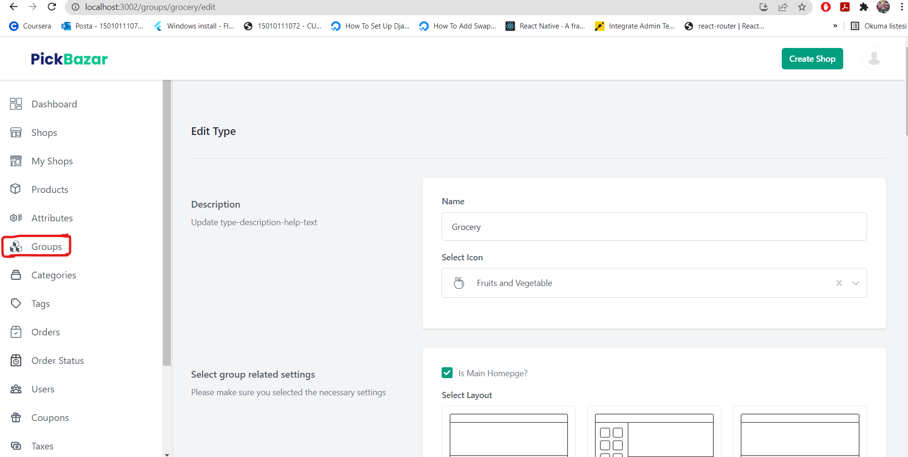

# Hello 
Hello from WORKinSELF developer team. Your mission should you choose to accept it, 
carefully read this file and do the tasks that we want you to complete.

# Description
1. Everything to run the template in DOCUMENTATION.md
2. We use a template named Pickbazar
3. We want to make so many things by removing some modules and adding new modules in this template.
4. It is your responsibility to understand how this template work, which technologies are used in this template
(in fact, everything is in DOCUMENTATION.md)
5. We want you to create a new layout for showing products in the panel and a new layout for product card.
   
6. So, new layout options can be seen in creating and editing the groups for products. For example; 
   ``` json
     {
       "id": 1,
       "name": "Grocery",
       "settings": {
       "isHome": true,
       "layoutType": "classic",
       "productCard": "neon"
       },
       "slug": "grocery",
       "icon": "FruitsVegetable",
       "promotional_sliders": [],
       "created_at": "2021-03-08T07:18:25.000000Z",
       "updated_at": "2021-08-18T17:12:14.000000Z",
       "banners": []
   ```
# How To Work
1. Please, clone the public repo
2. Then, create a local branch derived public repo master
3. After fnishing your work, please create a review
4. We will review with you the changes and you will explain what you did and template general structure.
5. Enjoy it, keep in touch.