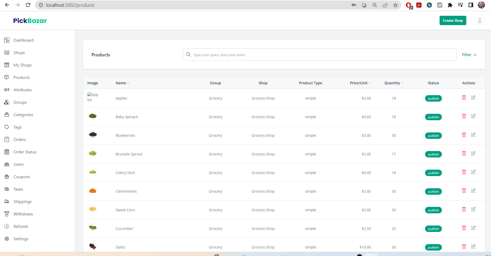

# Hello 
Hello from WORKinSELF developer team. Your mission should you choose to accept it, 
carefully read this file and do the tasks that we want you to complete.

# Description
1. Everything to run the template in DOCUMENTATION.md
2. We use a template named _Pickbazar_
3. We want to make so many things by removing some modules and adding new modules in this template.
4. It is your responsibility to understand how this template work, which technologies are used in this template
(in fact, everything is in DOCUMENTATION.md)
5. We want you to add new buttons into products list view.
   
6. Please add three button here: **Add New One**, **Export**, **Delete**
7. User can select one by one or select all the items in the table when click export button.
8. User can delete selected ones (one or many). So You must integrate rows selection in template.
9. Add New One is similar to Edit page, but we want you to specialize this page. 
All action must be run in pop-up(modal) menu. Adding new item must be stepped way.
10. You are free how think and design.
11. Please complete your task during the weekends 01-04 April 2022
12. You can contact system admin via tekin@workinself.com for your any question
# How To Work
1. Please, clone the public repo
2. Then, create a local branch derived public repo master
3. After finishing your work, please create a review (pull request). 
4. We will run your code and review together with you. We expect from you to  
So, please solve the system how work and be sure any questions about JS, Node, React, Nest, Next JS.
5. We will review with you the changes, you will explain what you did and template's general structure.
6. Enjoy it, keep in touch.